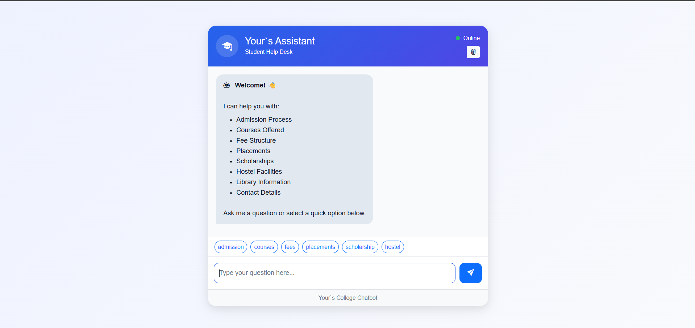
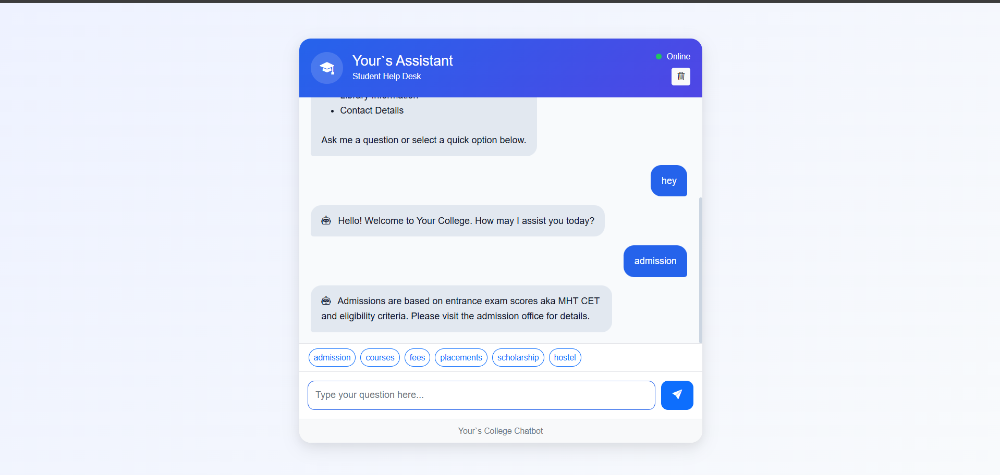
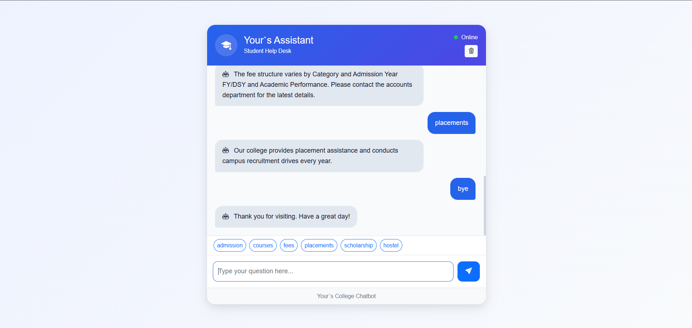
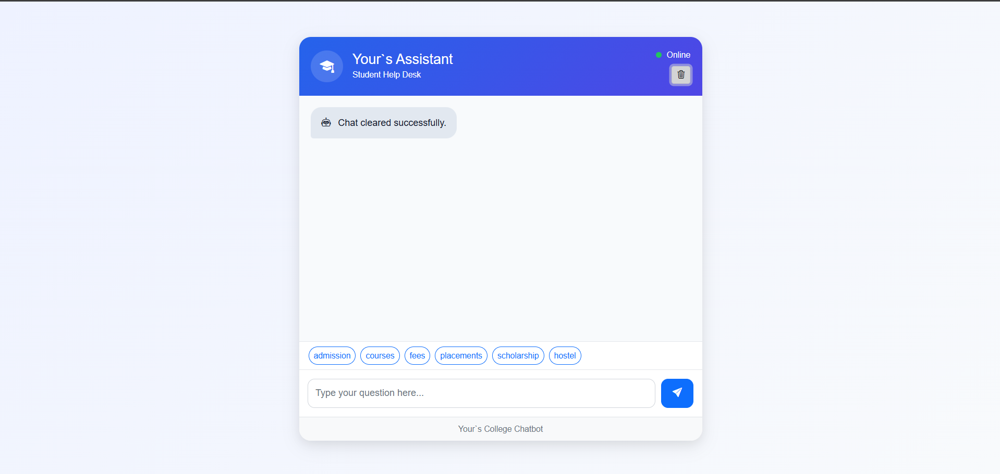

# 🎓 Smart College Information Chatbot

A web-based chatbot developed using Flask, HTML, CSS, Bootstrap, and JavaScript that helps students quickly access college-related information such as admissions, courses, fees, placements, scholarships, hostel facilities, library details, and contact information.

## 📌 Features

* Interactive chatbot interface
* Quick action buttons for common queries
* Admission information
* Courses offered
* Fee structure details
* Placement information
* Scholarship details
* Hostel information
* Library details
* Contact information
* Responsive design using Bootstrap
* Real-time chatbot responses using Flask

## 🛠️ Technologies Used

### Frontend

* HTML5
* CSS3
* Bootstrap 5
* Bootstrap Icons
* JavaScript

### Backend

* Python
* Flask

### Data Storage

* JSON (chatbot_data.json)

###OutPut
## Chatbot Home

## Chatbot Response1

## Chatbot Response2

## Chatbot Response3

## 💬 Sample Questions

* admission
* admission process
* courses
* fee structure
* placements
* scholarship
* hostel facilities
* library information
* contact details

## 🔄 Working Flow

1. User enters a question.
2. JavaScript sends the message to Flask using Fetch API.
3. Flask receives the request through the /chat route.
4. The chatbot searches matching patterns in chatbot_data.json.
5. The corresponding response is returned.
6. Flask sends the response back as JSON.
7. The chatbot displays the response on the screen.

## 🎯 Project Objective

The objective of this project is to provide students with quick and easy access to frequently requested college information through an interactive chatbot interface.

## 👨‍💻 Author

Varad

Computer Science Engineering Student

CodeAlpha Internship Project
